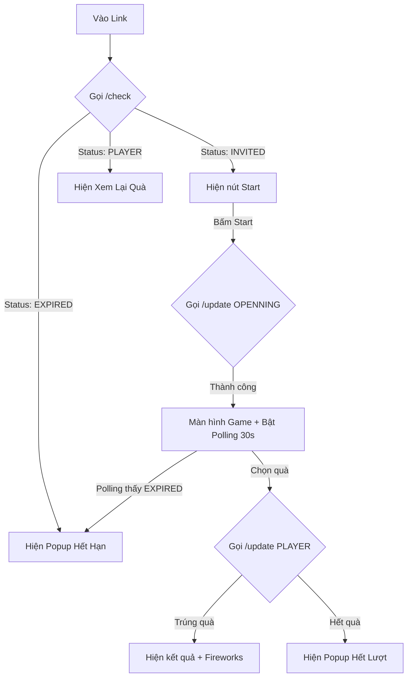

# PRD: LUỒNG NGƯỜI DÙNG & LOGIC TRẠNG THÁI GAME (MULTI-STATE GAME FLOW)

## 1. Giới thiệu (Introduction)
Tài liệu này quy định chuẩn hoá quy trình trải nghiệm người dùng (User Experience) và logic nghiệp vụ (Business Logic) cho các dòng game trúng thưởng có nhiều trạng thái (multi-state). Mục tiêu nhằm đảm bảo tính **công bằng**, **minh bạch** và **chống gian lận**.

---

## 2. Đối tượng & User Stories

### 2.1. Người chơi hợp lệ (Valid Player)
- **Story:** Là người có mã code hợp lệ và chưa từng tham gia trúng thưởng.
- **Mong muốn:** Tham gia game mượt mà, nhận quà đúng như kết quả hiển thị và có thể xem lại quà sau khi chơi.

### 2.2. Người chơi quay lại (Returning Player)
- **Story:** Người đã hoàn thành lượt chơi và quay lại link cũ.
- **Mong muốn:** Xem lại ngay phần quà đã trúng mà không phải thực hiện thao tác chơi lại.

### 2.3. Người chơi quá hạn (Timed-out Player)
- **Story:** Người vào link nhưng không chơi ngay, hoặc bị Backend đánh dấu hết hạn do quy định campaign (ví dụ: sau 10 phút).
- **Mong muốn:** Nhận được thông báo rõ ràng về việc hết hạn thay vì thấy lỗi hệ thống mơ hồ.

### 2.4. Kẻ tấn công/Người dùng gian lận (Attacker/Cheater)
- **Story:** Người cố tình mở nhiều tab, dùng script để spam request nhằm trúng nhiều quà hoặc quà xịn.
- **Mong muốn:** (Hệ thống chặn) Chỉ duy nhất 1 request hợp lệ đầu tiên được xử lý, các request sau bị từ chối.

---

## 3. Ma trận Trạng thái (State Matrix)

| Trạng thái (State) | Mô tả (Description) | Hành động UI (UI Action) |
| :--- | :--- | :--- |
| **INVITED** | Trạng thái gốc, người dùng mới vào link. | Hiển thị nút "Bắt Đầu Ngay". |
| **OPENNING** | Đã bấm bắt đầu, đang ở màn hình chọn quà. | Hiển thị màn hình chọn (Bao lì xì/Vòng quay). Bật Polling kiểm tra trạng thái. |
| **PLAYER** | Đã hoàn thành chơi và có quà trong DB. | Hiển thị nút "Xem Lại Quà" hoặc Popup kết quả. |
| **EXPIRED** | Bị khoá do quá thời gian hoặc vi phạm. | Hiển thị Popup "Hết hạn tham gia". |

---

## 4. Logic Xử lý & Cơ chế Chặn (Blocking Logic)

### 4.1. Luồng Chuyển trạng thái chuẩn (Happy Path)
1.  **Check:** Khi Load trang -> Gọi API `/check`.
2.  **Initialize:** Nếu là `INVITED` -> Hiện nút Start.
3.  **Transition 1:** Bấm Start -> Gọi `/update` chuyển sang `OPENNING` -> Lưu `localStorage` để đánh dấu session.
4.  **Transition 2:** Chọn quà -> Gọi `/update` chuyển sang `PLAYER` -> Nhận `prize_id` -> Hiện kết quả.

### 4.2. Cơ chế Chống Gian lận & Công bằng
-   **Khóa đồng thời (Concurrency Lock):**
    -   Sử dụng cột `lock_status` trong Database.
    -   Mỗi request phải ghi một `LockID` duy nhất và đọc lại (Polling check) để xác nhận quyền sở hữu trước khi thực hiện phát quà.
    -   Chặn đứng việc 2 người cùng trúng 1 món quà cuối cùng.
-   **Chặn Spam (Idempotency):**
    -   Tại API `/update`, nếu trạng thái hiện tại đã là `PLAYER`, hệ thống trả về ngay kết quả cũ thay vì thực hiện quay số lại.
-   **Kiểm tra trạng thái thời gian thực (Real-time Polling):**
    -   Khi ở màn hình game (`OPENNING`), trình duyệt tự động check trạng thái mỗi 30 giây.
    -   Nếu trạng thái bị đổi thành `EXPIRED` từ phía Server, UI lập tức chặn người dùng.

### 4.3. Logic Chặn theo Thời gian (Timeout)
-   Hệ thống ghi lại mốc thời gian `UpdatedAt` khi chuyển sang `OPENNING`.
-   Nếu `Now - UpdatedAt > 10 phút` (cấu hình tuỳ campaign):
    -   Server: Từ chối các request chuyển sang `PLAYER`.
    -   Client: Hiển thị Popup Expired.

---

## 5. Quy định về Hiển thị (UI/UX Standards)

1.  **Tránh Flicker (Nháy giao diện):**
    -   Sử dụng Loading Overlay hoặc Spinner khi đang gọi API check trạng thái.
    -   Không hiển thị bất kỳ nút bấm hành động nào cho đến khi xác định được trạng thái chính xác.
2.  **Thông báo rõ ràng:**
    -   Mã không tồn tại -> Hiện lỗi truy cập.
    -   Hết quà -> Hiện thông báo hết quà/cảm ơn.
    -   Hết hạn -> Hiện thông báo hết hạn.
3.  **Tính nhất quán:**
    -   Dữ liệu hiển thị trên UI (Tên quà, hình ảnh) phải khớp 100% với `prize_id` trả về từ Server.

---

## 6. Sơ đồ Logic (Technical Flow)

